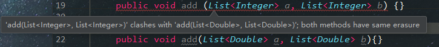
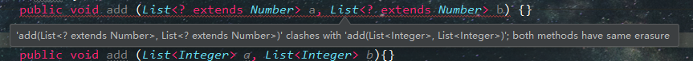

# 泛型擦除的相关知识

> 整理自书籍《编写高质量代码:改善java程序的151个建议》

## java的泛型是类型擦除的

“java的泛型是擦除的”  这句话的意思是:java的泛型在编译期有效，在运行期是被删除。换句话说就是泛型参数类型在编译后都会被清除掉

试写一段重载的代码的两个方法，参数的类型分别为List&lt;Integer&gt;和List&lt;Double&gt;，按理来说这是两个不同的类
型，应该能够重载成功的，但是:

Idea提示此处编译错误，这段错误的意思是add(List&lt;Integer&gt;)与add(List&lt;Double&gt;)擦除后的类型是重复的，
通俗的说就是方法签名重复了。这个就是类型擦除后引起的问题。

### 在编译后所有的泛型类型都会做相应的转换，规则如下:
* List&lt;String&gt;、List&lt;Integer&gt;、List&lt;T&gt;擦除后的类型为List
* List&lt;String&gt;[]擦除后的类型为List[]
* List&lt;? extends E&gt;、List&lt;? super E&gt;擦除后的类型为List&lt;E&gt;
* List&lt;T extends Serializable&Cloneable&gt;擦除后为List&lt;Serializable&gt;

以上规则需要注意的是，List&lt;? extends E&gt;与List&lt;E&gt;也是不能进行重载的，同样会编译错误


明白了擦除规则，再看以下代码:
```java
public class Main{
    public static void main(String[] args) {
        List<String> list = new ArrayList<>();
        list.add("1");
        String i = list.get(0);
    }
}
```
经过编译器的擦除处理后，上面的代码与下面的代码是一样的
```java
public class Main {
    public static void main(String[] args) {
        List list = new ArrayList<>();
        list.add("1");
        String i = (String) list.get(0);
    }
}
```
### Java编译后的字节码中已经没有泛型的任何消息了。之所以这么做是有两个原因:
* 避免JVM的大换血.如果JVM也把泛型类型延续到运行期(C++便是如此)，那么JVM就需要进行大量的重构工作
* 版本兼容。在编译期擦除可以更好地支持原声类型(Raw Type)

### 解释类型擦除带来的部分问题:
#### 1、泛型的class对象是相同 
List&lt;Integer&gt;定义的对象与List&lt;Double&gt;定义的对象是通过getClass()方法获得的class对象是一样的
(使用==判断后的结果为true)  
#### 2、泛型数组初始化时不能声明泛型类型
以下代码编译时不能通过:
```
        List<String>[] lists = new List<String>[10];
```
原因很简单，可以声明一个带泛型参数的数组，但是不能初始化该数组，因为执行了类型擦除操作，List&lt;Object&gt;与List&lt;String&gt;
就是同一回事了，编译器拒绝如此声明。  
#### 3、 instanceof不允许存在泛型参数
以下代码编译时不能通过:
```
        List<String> list = new ArrayList<>();
        System.out.println(list instanceof List<String>);
```
会提示如下错误:  
```
Cannot perform instanceof check against parameterized type List<String>
无法对参数化List<String>执行instanceof检查
Use the form List<?> instead since further generic type information will be erased at runtime
使用形式List<?>，因为进一步的泛型类型信息将在运行时被擦除
```
#### 4、自动类型转换  
因为类型擦除的问题，所以所有的泛型类型变量最后都会被替换成原始类型。那么为什么我们在获取的时候不需要进行强制类型转换呢？这个问题可以看一下
ArrayList的get方法:
```
        public E get(int index) {
            RangeCheck(index);
            return(E) elementData[index];
        }
```

#### 5、不能初始化泛型参数和数组
因为泛型在编译期被擦除，我们在类初始化时无法获取泛型的具体参数，如下代码是不能通过编译的:
```java
        class Test<T> {
            private T t = new T();
            private T[] tArray = new T[5];
        }
```
但是我们使用```List<T> list = new ArrayList<T>();```是可以安全编译的。因为ArrayList表面上是泛型，其实已经在编译期转型为Object了。
这一点可以查看一下ArrayList的源码就知道了。
假如我们真的需要泛型数组，可以如下处理:
```java
        class Test<T> {
            private T t;
            private T[] tArray;
            public Test() {
                try {
                    Class<?> tType = Class.forName("");
                    t = (T)tType.newInstance();
                    tArray = (T[])Array.newInstance(tType, 5);
                } catch (Exception e) {
                    e.printStackTrace();
                }
            }
        }
```
运行时没有任何问题了。我们需要知道的就是怎么在运行的时候获得T的类型，也就是tType参数，一般情况下是无法获取的，不过我们可以在客户端调用的时候
增加一个T类型的class。  
类的成员变量是在类初始化前初始化的，所以要求在初始化前它必须具有明确的类型，否则就只能声明，不能初始化。
