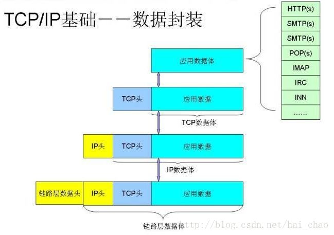
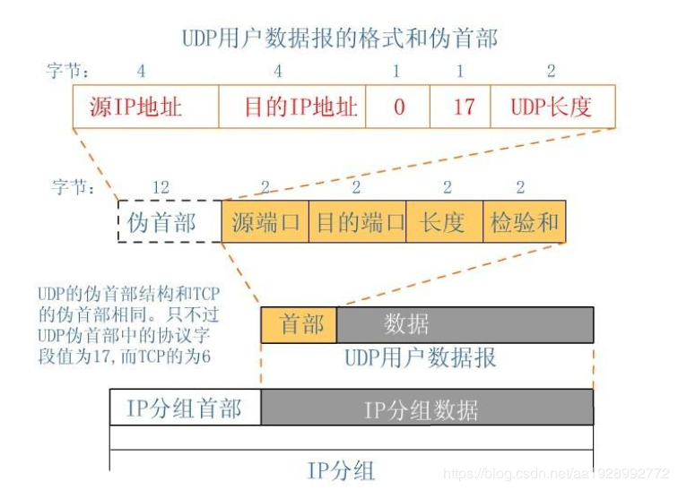
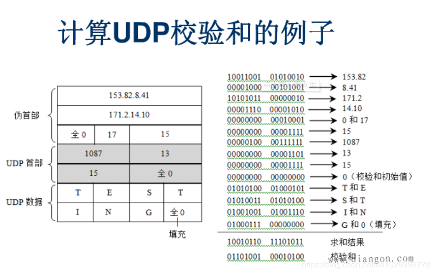

# TCP和UDP

> 参考文章
>《[说说TCP，UDP和socket,Http之间联系和区别](https://blog.csdn.net/hai_chao/article/details/79626161)》
>《[UDP协议的详细解析](https://blog.csdn.net/aa1928992772/article/details/85240358)》
## TCP协议

### 什么是TCP协议？
TCP(Transmission Control Protocol 传输控制协议),是一种面向连接、可靠的、基于字节流的传输层通信协议，由IETF的RFC793定义。  
在因特网协议族(Internet protocol suite)中，TCP层是位于IP层之上，应用层之下的中间层。不同主机的应用层之间经常需要可靠的、像
管道一样的连接，但是IP层不提供这样的流机制，而是提供不可靠的包交换。  

### TCP的报文
具体内容解析查看[报文](../报文.md)

### TCP编程步骤

#### TCP编程的服务器端一般步骤是：
1. 创建一个socket，用函数socket()
2. 设置socket属性，用函数setsockopt()
3. 绑定IP地址、端口等信息到socket上，用函数bind()
4. 开启监听，用函数listen()
5. 接收客户端上来的连接，用函数accept()
6. 收发数据，用函数send()和recv()，或read()和write()
7. 关闭网络连接
8. 关闭监听

#### TCP编程的客户端一般步骤是:
1. 创建一个socket()，用函数scoket()
2. 设置socket属性，用函数setsockopt();可选
3. 绑定IP地址、端口等信息到socket上，用函数bind()
4. 设置要连接的对方的IP地址和端口等属性
5. 连接服务器，用函数connect()
6. 收发数据，用函数send()和recv()，或read()和write()
7. 关闭网络连接

### TCP的三次握手和四次挥手
客户端发送连接请求需要通过三次握手才能和服务器确认连接，四次挥手关闭与服务器之间的连接。具体查看[TCP三次握手和四次挥手](TCP三次握手和四次挥手.md)

### TCP的优点
**可靠、稳定**  
TCP的可靠提现在TCP在传输数据之前，会进行三次握手来建立连接，而且在数据传递时，有确认、窗口、重传、拥塞控制机制，在数据传完之后，还会断开连接用来节约
系统资源

### TCP的缺点
**慢，效率低，占用系统资源高，易被攻击**  
在传输数据之前要先建立连接，这会消耗时间，而且在数据传递时，确认机制、重传机制、拥塞机制等都会消耗大量时间，而且要在每台设备上维护所有的传输连接。
每个链接都会占用系统的CPU、内存等硬件资源。  
因为TCP有确认机制、三次握手机制，这些也导致TCP容易被利用，实现DOS、DDO、CC等攻击

## UDP协议

### 什么是UDP协议？
UDP(User Datagram Protocol,用户数据报协议)，是OSI(Open System Interconnection,开发式系统互联)参考模型中一种无连接的传输层协议，
提供面向事务的简单不可靠信息传送服务，IETF RFC 768是UDP的正式规范。UDP在IP报文的协议号是17。

### UDP编程步骤

#### UDP编程的服务器端一般步骤是：
1. 创建一个socket，用函数socket()
2. 设置socket属性，用函数setsockopt()
3. 绑定IP地址、端口等信息到socket上，用函数bind()
4. 循环接收数据，用函数recvfrom()
5. 关闭网络连接

#### UDP编程的客户端一般步骤是：
1. 创建一个socket，用函数socket()
2. 设置socket属性，用函数setsockopt()
3. 绑定IP地址、端口等信息到socket上，用函数bind()
4. 设置对方的IP地址和端口等属性
5. 发送数据，用函数sendto()
6. 关闭网络连接

### UDP的报文
具体内容解析查看[报文](../报文.md)

### UDP的校验
在计算校验和的时候，需要在UDP数据报之前增加12字节的伪首部，伪首部并不是UDP真正的首部。只是在计算校验和，临时添加在UDP数据报的前面，得到一
个临时的UDP数据报。校验和就是按照这个临时的UDP数据报计算的。**伪首部既不向下传送也不向上递交，而仅仅是为了计算校验和**。这样的校验和，既
检查了UDP数据报，又对IP数据报的源IP地址和目的IP地址进行了校验。  
  
UDP校验和的计算方法和IP数据报首部校验的计算方法相似，都使用**二进制反码运算求和再取反**，但不同的是：IP数据报的校验和只校验IP数据报和首部，但UDP
的校验和是把首部和数据部分一起校验。  
发送方，首先是把全零放入校验和字段并且添加伪首部，然后把UDP数据报看成是由许多16位的子串连接起来，若UDP数据报的数据部分不是偶数个字节，则要在
数据部分末尾增加一个全零字节（此自己不发送），接下来就按照二进制反码计算出这些16位字的和。将此和的二进制反码写入校验和字段。在接收方，把收到的UDP
数据报加上伪首部（如果不为偶数个字节，还需要补上全零字节）后，按照二进制反码计算出这些16位字的和。**当无差错时其结果全为1**，否则就表明有差错出现，
接收方应该丢弃这个UDP数据报。  
  
**注意：**
1. 校验时，若UDP数据报部分的长度不是偶数个字节，则需要填入一个全0字节，但是次字节和伪首部一样，都是不发送的。
2. 如果UDP校验和校验出UDP数据报是错误的，可以丢弃，也可以交付上层，但是要附上错误报告，告诉上层这是错误的数据报
3. 通过伪首部，不仅可以检查源端口号，目的端口号和UDP用户数据报的数据部分，还可以检查IP数据报的源IP地址和目的地址  
这种差错校验的检错能力不强，但是简单，速度快。

### UDP的优点
**快，比TCP稍安全**  
UDP没有TCP拥有的各种机制，是一个无状态的传输协议，所有传递数据非常快，没有TCP的这些机制，被攻击利用的机制就少了一些，但是也无法避免被攻击

### UDP的缺点 
**不可靠，不稳定**
因为没有TCP的机制，UDP在传输数据过程中，可能因为网络问题而导致丢包，造成数据的丢失

## TCP和UDP的区别
| |TCP|UDP|
|:---:|:---:|:---:|
|连接|有连接|无连接|
|速度|建立连接，拥有各种机制消耗较多时间，速度慢|不需要连接，没有各种机制，速度快|
|目的主机|仅能一对一|一对一，一对多，多对一，多对多|
|带宽|消耗更多的带宽|UDP报头较短，消耗更少|
|消息边界|无|有|
|可靠性|高，保证数据的正确性|低，可能丢包|
|顺序|有序|无序|
|逻辑通信信道|全双工的可靠信道|不可靠信道|
|首部开销|20个字节|8字节|
|适用场景|对数据传输的质量有较高要求，但对实时性要求不高。如HTTP，HTTPS，FTP等传输文件的协议以及POP，SMTP等邮件传输的协议|只对数据传输的实时性要求较高，但不对传输质量有要求。比如视频传输，实时通信(QQ)等|

