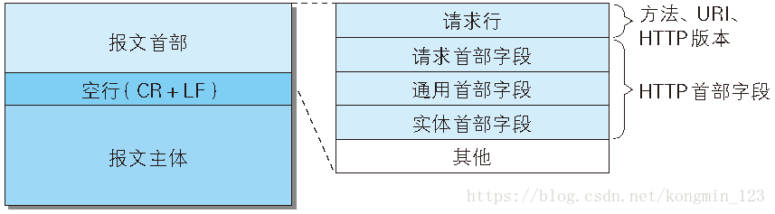
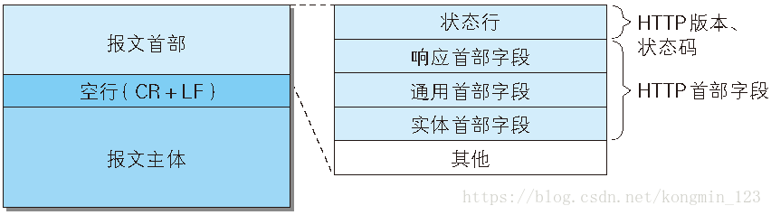

# HTTP报文

> 参考[HTTP报文的结构](https://blog.csdn.net/kongmin_123/article/details/82154780)
### 什么叫HTTP报文
HTTP报文是用于HTTP协议交互的信息，HTTP报文本身是由多行数据构成的字符串文本。客户端的HTTP报文叫做请求报文，服务器端的HTTP报文叫做响应报文

### HTTP请求报文

一个HTTP请求报文由请求行、请求头部、空行和请求数据4个部分构成
  
请求报文类型:(来自ie浏览器网页报文截取)
```
GET / HTTP/1.1
Host: www.baidu.com
Connection: Keep-Alive
User-Agent: Mozilla/5.0 (Windows NT 10.0; WOW64; Trident/7.0; rv:11.0) like Gecko
Accept: application/javascript, */*; q=0.8   
Accept-Encoding: gzip, deflate
Accept-Language: zh-Hans-CN, zh-Hans; q=0.5
Referer: https://hao.qq.com/?unc=Af31026&s=o400493_1  
Cookie: BAIDUID=6718DC14E68E5349F3E7EA1E94C2DEBB:FG=1; BIDUPSID=6718DC14E68E5349F3E7EA1E94C2DEBB; PSTM=1555857209
```
#### 1.请求行
请求行数据格式由三个部分组成，请求方法，URI，HTTP协议版本，用空格隔开，举例如下：
```
GET /index.html HTTP/1.1
```
##### 1.1 HTTP请求方法
HTTP请求方式中一共有8种请求方法  

序号|方法|描述
:---:| :---: | :---: 
 1 | GET | 请求指定的页面信息，并返回实体主体 
 2 | HEAD | 类似于get请求，只不过返回的响应中没有具体的内容，用于获取报头 
 3 | POST | 向指定资源提交数据进行处理请求（例如提交表单或者上传文件）。数据被包含在请求体中。 
 4 | PUT | 从客户端向服务器传送的数据取代指定的文档的内容 
 5 | DELETE | 请求服务器删除指定的页面 
 6 | CONNECT | HTTP/1.1协议中预留给能够将连接改为管道方式的代理服务器 
 7 | OPTIONS | 允许客户端查看服务器的性能
 8 | TRACE | 回显服务器收到的请求，主要用于测试或诊断 
 
 最常用的两种请求方法是GET和POST,具体请跳转[GET和POST](GET和POST.md)
 ##### 1.2 HTTP协议  
 HTTP协议版本有两种：HTTP1.0/HTTP1.1
 区别在于HTTP1.0对于每个链接都只能传送一个请求和响应，请求完服务器返回响应就会关闭，HTTP1.0没有POST字段。而
 HTTP1.1在同一个连接中可以传送多个请求和响应，多个请求可以重叠和同时进行，HTTP1.1必须有Host字段。
 #### 2.请求头部
 请求头部紧跟着请求行，该部分主要是用于描述请求正文。
 ```
Host: www.baidu.com
Connection: Keep-Alive
User-Agent: Mozilla/5.0 (Windows NT 10.0; WOW64; Trident/7.0; rv:11.0) like Gecko
Accept: application/javascript, */*; q=0.8
......
```
 主要用于说明请求源、连接类型、以及一些Cookie信息等。
 #### 3.请求正文
 请求正文和请求头部通过一个空行进行隔开，一般用于存放POST请求类型的请求正文，以上的请求方法为GET因此请求正文为空，若为POST
 方法，请求正文可以举例如下:
```
username=IJEERY&sex=man
```
 
### HTTP响应报文
HTTP响应报文由状态行、响应头部、空行和响应体四个部分构成

#### 1.状态行
状态行包括HTTP协议的版本号，状态码，响应描述
```
HTTP/1.1 200 OK
```
##### 1.1状态码
状态码告知从服务器返回的请求的状态，一般由一个三位数组成，分别以整数1~5开头组成。各个响应的类型对应的含义如下：
1. 1XX 请求正在处理
2. 2XX 请求成功  
   + 200 OK: 正常处理
   + 204 no content: 请求处理成功但没有资源可返回
   + 206 Partial Content: 对资源的某一部分请求
3. 3XX 重定向
   + 301 Moved Permanenly: 请求资源的URI已经更新（永久移动），客户端会同步更新URI。
   + 302 Found: 资源的URI已临时定位到其他位置，客户端不会更新URI
   + 303 See Other: 资源的URI已更新，明确表示客户端要使用GET方法获取资源
   + 304 Not Modified: 当客户端附带条件请求访问资源时资源已找到但未符合条件请求
   + 307 Temporary Redirect: 临时重定向
4. 4XX 客户端错误
   + 400 Bad Request: 请求报文中存在语法错误，一般为参数异常
   + 401 Unauthorized: 发送的请求需要HTTP认证
   + 403 Forbidden: 不允许访问，对请求资源的访问被服务器拒绝
   + 404 Not Found: 无法找到请求的资源，请求资源不存在
   + 405 Method Not Allowed: 请求方式不支持
5. 5XX 服务器错误
   + 500 Internal Server Error: 服务器的内部资源出故障，服务器在执行请求时发生了错误
   + 503 Service Unavailable: 服务器暂时处于超负载状态或正在进行停机维护，无法处理请求，服务器正忙
#### 2.响应头部 
响应头部如下(截取自google浏览器Response Headers)
```
Connection: keep-alive
Content-Type: application/javascript;charset=utf-8
Date: Sat, 31 Aug 2019 03:05:24 GMT
Server: PS-DSP/1.0
Transfer-Encoding: chunked
```
用于说明连接类型，连接服务器等信息。
#### 3.响应体
响应体即为请求需要得到的具体数据，可以为任何数据类型，包括超文本，文本，图片等等，一般为html文件信息
```html
<html>
<head>
<title>title of html</title>
</head>
<body>
<h1>HTTP报文</h1>
</body>
</html>
```