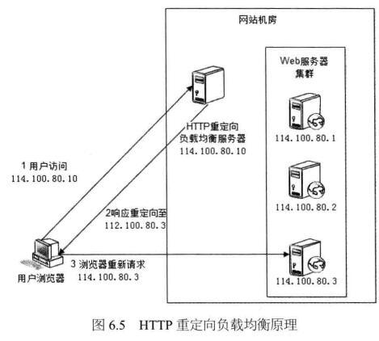
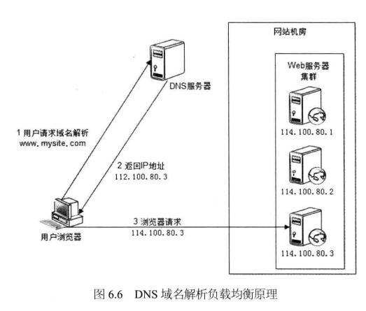
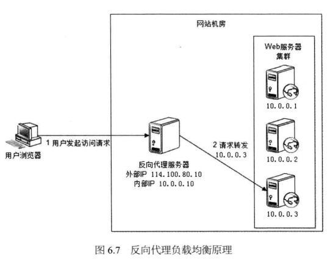
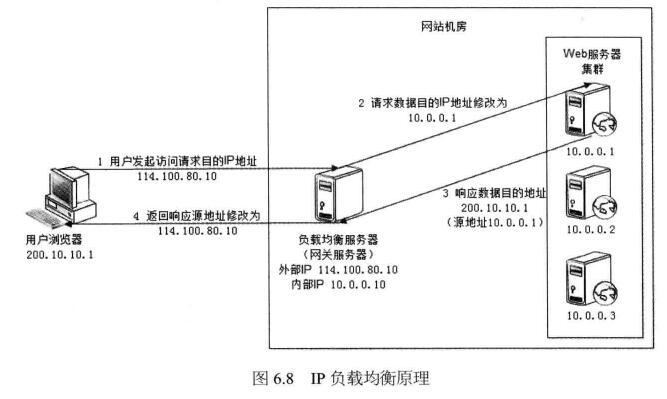
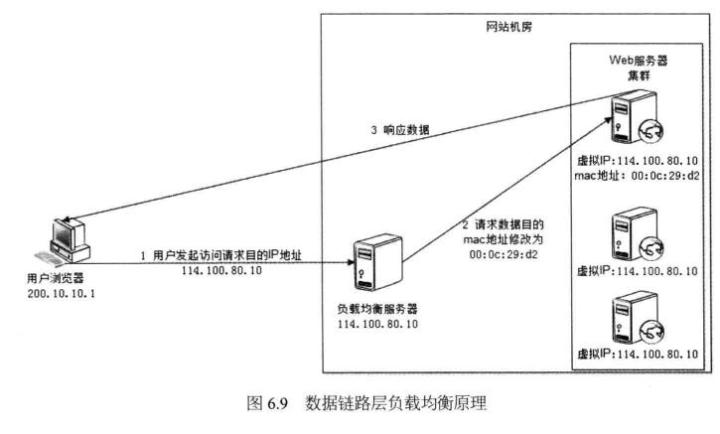

# Web负载均衡

## HTTP重定向
 web服务器可通过http响应头信息中的Location标记来返回一个新的URL，浏览器自动去访问这个新的URL。
 实现：可以通过web应用程序代码实现你想到的调度策略，如可根据请求的URL的不同来进行合理的过滤和转移

 
 
## DNS负载均衡
 DNS负责将用户请求的域名映射为实际的IP地址，这种映射可以是一对多的（DNS的A记录，用来指定域名对应的IP地址），
 这样DNS服务器便充当负载均衡调度器  
 
 DNS节省了所谓的主站点，DNS服务器已经充当了主站点的职能，常用的策略是对多个A记录进行RR（轮询）  
 
 
 
##反向代理负载均衡
反向代理服务器的核心工作时转发HTTP，它工作在HTTP层面，因此，基于反向代理的负载均衡也成为七层负载均衡。  

任何对于实际服务器的HTTP请求都必须经过调度器；调度器必须等待实际服务器的HTTP响应，并将它反馈给用户  

 
 
##IP负载均衡
 网络地址转换（NAT）负载均衡工作在传输层，对数据包中的IP地址和端口进行修改，从而达到转发的目的，成为四层负载均衡。  
 
 NAT服务器（前端服务器）必须作为实际服务器（后端服务器）的网关，否则数据包被转发后将一去不返。
 
 
 
##直接路由
 这种方式工作在数据链路层。它修改数据包的目标MAC地址，并没有修改目标IP（因为这种转发工作在数据链路层，它对上层端口无能为力），
 然后发给实际的服务器，实际服务器的响应数据直接发回给用户，而不用经过调度器。但实际服务器必须接入外网，而且不能将调度器作为默
 认网关，要给实际服务器添加和调度器IP地址相同的IP别名。
 
 
 
 ##IP隧道
 基于IP隧道的负载均衡系统也可以使用LVS来实现，成为LVS-TUN。与LVS-DR不同的是，实际服务器和调度器可以不在同一个WAN网段
 ，调度器通过IP隧道技术来转发请求到实际服务器，所以实际服务器必须有合法的IP地址。  
 
 基于IP隧道的请求转发机制，是将调度器收到的IP数据包封装在一个新的IP数据包中，转交到实际服务器，然后实际服务器的响应数据包
 可以直接到达用户端。  
 
 基于IP隧道的独特方式，可以将实际服务器部署在不同的地域并根据就近原则转移请求，比如一些CDN服务器就是基于IP隧道技术实现的。