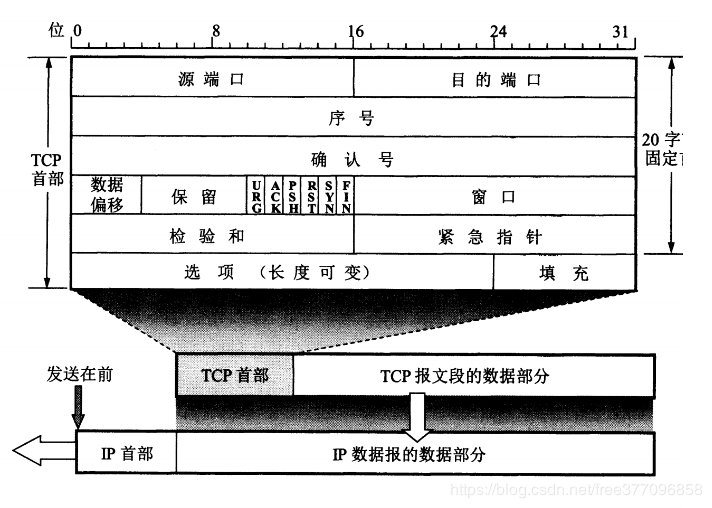
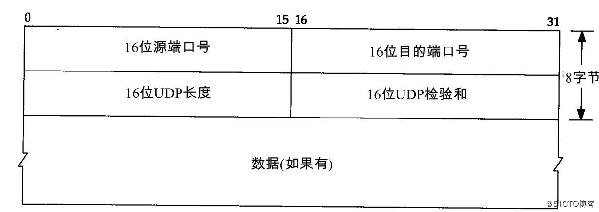

# 报文

> 报文是网络中交换与传输的数据单元，即站点一次性要发送的数据块。报文包含了将要发送的完整的数据信息，其长短很不一致，长度不限且可变（[来自百度百科](https://baike.baidu.com/item/%E6%8A%A5%E6%96%87/3164352?fr=aladdin)）

> 参考（[TCP、UDP报文格式](https://blog.csdn.net/free377096858/article/details/88773682)；[TCP/IP 数据包报文格式](https://blog.51cto.com/lyhbwwk/2162568)）
### TCP报文 
TCP报文由首部和数据两部分组成。首部一般由20-60字节构成，长度可变。其中前20B格式固定，后40B为可选。

#### 1.源端口号
长度为16位,指明发送报文的进程
#### 2.目的端口号
长度为16位，指明目的主机接收数据的进程
#### 3.序号
也称为序列号，长度为32位，序号用来标识从TCP发送端向接入端发送的数据字节流进行编号，可以理解成对字节流的计数
#### 4.确认号
长度为32位，确认号包含发送确认的一端所期望收到的下一个序号。确认号只有在ACK标志位1时才有效。
#### 5.数据偏移（首部长度）
长度为4，用于表示TCP报文首部的长度。用4位（bit）表示，十进制值就是[0,15],一个TCP报文前20个字节是必有的，后40个根据情况可能有可能没有。
如果TCP报文首部是20个字节，则该位应是20/4=5。
#### 6.保留位
长度为6位，必须是0，它是为将来定义新用途保留的。
#### 7.标志
长度为6位，在TCP报文中不管是握手还是挥手还是传数据等，这6位标志都很重要。6位从左到右依次为：
+ **URG**：紧急标志位，说明紧急指针有效；
+ **ACK**：确认标志位，多数情况下空，说明确认序号有效；
+ **PSH**：推标志位，置位时表示接收方应立即请求将报文交给应用层；
+ **RST**：复位标志，用于重建一个已经混乱的连接；
+ **SYN**：同步标志，该标志仅在三次握手建立TCP连接时有效
+ **FIN**：结束标志，带该标志位的数据包用于结束一个TCP会话
#### 8.窗口大小
长度为16位，TCP流量控制由连接的每一端通过声明的窗口大小来提供。
#### 9.检验和
长度为16位，该字段覆盖整个TCP报文端，是个强制性的字段，是由发送端计算和存储，到接收端后，由接收端进行验证。
#### 10.紧急指针
长度16位，指向数据中优先部分的最后一个字节，通过接收方紧急数据的长度，该字段在URG标志置位时有效。
#### 11.选项
长度为0-40B(字节)，必须以4B为单位变化，必要时可以填充0。通常包含：最长报文大小、窗口扩大选项、时间戳选项、选择性确认等。
   
### UDP报文
UDP数据报由首部和数据两部分组成，其中首部只有8B（字节）。

#### 1.源端口号
长度为16位，指明发送数据的进程
#### 2.目的端口号
长度为16位，指明目的主机接收数据的进程
#### 3.长度
长度为16位，该字段值为报头和数据两部分的总字节数
#### 4.检验和
长度为16为，UDP检验和作用于UDP报头和UDP数据的所有位。由发送端计算和存储，由接收端校验。

